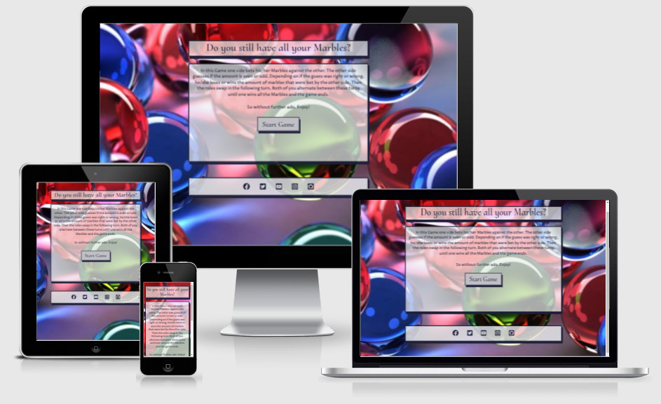

<h1 align="center"><a name="top">The Marbles Game Website</a></h1>

[View the live project here.](https://mycrosys.github.io/marblesgame/)

This is a Minigame website about keeping your marbles and not losing it. It is designed to be a game of chance and not a game of skill, so everything is based on you getting lucky with the numbers. The whole game takes place on a single website, with Javascript handling both the DOM and the actual calculations of the gameplay. It is responsive on both Desktop and mobile devices and easy to play both for first-time and returning visitors. The main target audience are people looking for a quick game to play during a break or while waiting in a line or for a bus on the go.

<h2 align="center"></h2>

## User Experience (UX)

*   ### Five Planes of UXD
    -   #### Strategy Plane
        1. The Strategy for this Site is mostly a Personal, mainly to pass the Portfolio 2 Project. I want to do this by creating a Website with a Minigame written in Javascript, which targets people wanting to play a quick game while waiting in line, for a bus or just in their break time.
        2. For that reason I got inspired by watching a Korean show named [Squid Game](https://en.wikipedia.org/wiki/Squid_Game) on Netflix. The Show evolves around a group of people playing games from their childhood to win a big cash prize that could change their lives (or die trying). One of these games was a game evolving around betting a certain amount of marbles and the other side guessing if the amount of marbles that the player bet is even or uneven.

    -   #### Scope Plane

        1. The Game will cover both the Betting and Guessing part of the Gameplay with one side winning when the other side has 0 marbles.
        2. The Site will only use a single page and everything happens via DOM Javascript manipulation.
        3. Scoreboard and History of actions are out of scope. A Scoreboard doesn't make sense to begin with, because you can modify the starting variables so much, that there isn't something to rate your performance. In addition, this is a game of chance, not of skill. As for a history of turns, there isn't enough screen space to make this viable on mobile devices. The result of the last turn will always be visible while playing though.

    -   #### Structure Plane

        1. The Structure of the Site should be simple. I decided for a linear structure, progressing with each click of a button. The player can always quit the game and in this game the button press will reload the page and bring him/her right back to the start.
        2. There is only a single Page. Players cannot get lost or get confused by the navigation because everything happens within that single page.
    
    -   #### Skeleton Plane

        1. The [Wireframes](#wireframes) can be found further down in this Document.
        2. Once the player presses on Start Game, he enters the setting portion of the game, where he can modify the amount of starting marbles for both the player and computer.
        3. He then enters the playing field. The top box contains the score, the middle box contains the actual playing part and the bottom box contains the last turn results.
        4. Then the game actually starts, with the player having to bet an amount of marbles first and then guessing even or odd in the next round. This repeats until one side has 0 marbles left. There is an announcement of the winner and then the player is sent back to the start screen with another button press.

    -   #### Surface Plane

        1. The Page is presented with multiple rounded Boxes with a 3D effect (box-shadow) below each other.
        2. Fontawesome was used for the footer links. Comparable Icons are used on other sites so this should feel familiar to the visitor.
        3. Further, Details like Font/Color choice, etc. can be found in the next separate Section: [Design](#design).

 

*   ### <a name="design">Design</a>
  
    -   #### Colour Scheme
        -   The three main colors used are a dark blue-greyish (#1E2039), a variation of white (#eceef0) with a 70% opacity and a silver-grey (#BFBFC4). The blue-grey is used for the boxes border, shadow and text color, while the white is used for the box's background and buttons hover effect. The silver-grey is the main background color for the buttons.
  
    -   #### Typography
        -   The Proza Libre font is used as the main font for the whole website with Helvetica, Arial and sans-serif as fallback fonts in case the font doesn't import correctly. It is a very easy to read font on all devices and is mainly used for explanations of how the game works and warnings if something does not work (e.g. no javascript enabled).
        -   To complement this, Cormorant Upright is used as a main header font. Its main purpose is to support the site's theme with its unique look. The backup fonts are Garamond and Times New Roman.
  
    -   #### Imagery
        -   The site contains a large background marble image to create a sense of familiarity. There're no other images used because I opted for a simple style that emphasizes a single element and not overloads the visitor visually.
  
 

*   ### User stories

    -   #### First Time Visitor Goals

        1. As a First Time Visitor, I want to easily understand the main purpose of the site and learn how the game works.
        2. As a First Time Visitor, I want the game to be explained well and easily play through every part of it.

    -   #### Returning Visitor Goals

        1. As a Returning Visitor, I want to quickly get into a game and play it in my break time or while I wait for something IRL.

 

