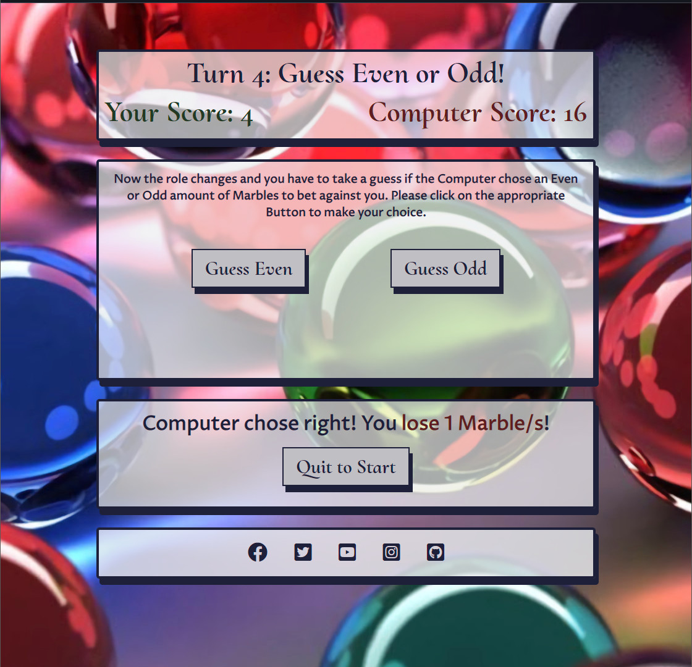
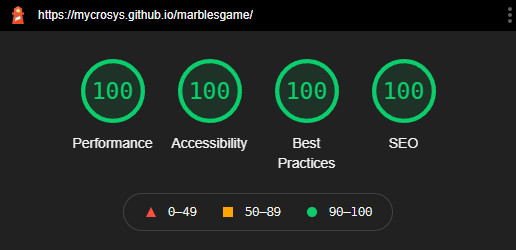

<h1 align="center"><a name="top">The Marbles Game Website</a></h1>

[View the live project here.](https://mycrosys.github.io/marblesgame/)

This is a Minigame website about keeping your marbles and not losing it. It is designed to be a game of chance and not a game of skill, so everything is based on you getting lucky with the numbers. The whole game takes place on a single website, with Javascript handling both the DOM and the actual calculations of the gameplay. It is responsive on both Desktop and mobile devices and easy to play both for first-time and returning visitors. The main target audience are people looking for a quick game to play during a break or while waiting in a line or for a bus on the go.

<h2 align="center"></h2>

  

## Table of Contents
### I. User Experience
-   [Five Planes of UXD](#fiveplanes)
-   [Design](#design)
-   [User Stories](#userstories)
-   [Wireframes](#wireframes)

 

### II. The Game
-   [Basics](#thegamebasics)
-   [Starting the Game](#thegamestarting)
-   [Setting options](#thegamesettings)
-   [Core Gameplay Loop](#thegamegameplayloop)
-   [Max amount of betable Marbles](#thegamemaxbet)
-   [Winning and Losing](#thegamewinning)

 

### III. Features
-   [Responsive on all device sizes](#responsive)
-   [Interactive elements](#interactive)
-   [Error Handling](#errorhandling)

 

### IV. Technologies Used
-   [Languages Used](#languages)
-   [Frameworks, Libraries & Programs Used](#usedtools)

 

### V. Testing
-   [General Testing](#generaltesting)
-   [Google Lighthouse Testing](#lighthousetesting)
-   [Testing User Stories from User Experience (UX) Section](#userstoriestesting)
-   [Further Testing](#furthertesting)
-   [Known Bugs](#knownbugs)

 

### VI. [Deployment](#deployment)

 

### VII. [Credits](#credits)

  

## User Experience (UX)

*   ### <a name="fiveplanes">Five Planes of UXD</a>
    -   #### Strategy Plane
        1. The Strategy for this Site is mostly a Personal, mainly to pass the Portfolio 2 Project. I want to do this by creating a Website with a Minigame written in Javascript, which targets people wanting to play a quick game while waiting in line, for a bus or just in their break time.
        2. For that reason I got inspired by watching a Korean show named [Squid Game](https://en.wikipedia.org/wiki/Squid_Game) on Netflix. The Show evolves around a group of people playing games from their childhood to win a big cash prize that could change their lives (or die trying). One of these games was a game evolving around betting a certain amount of marbles and the other side guessing if the amount of marbles that the player bet is even or uneven.

    -   #### Scope Plane
        1. The Game will cover both the Betting and Guessing part of the Gameplay with one side winning when the other side has 0 marbles.
        2. The Site will only use a single page and everything happens via DOM Javascript manipulation.
        3. Scoreboard and History of actions are out of scope. A Scoreboard doesn't make sense to begin with, because you can modify the starting variables so much, that there isn't something to rate your performance. In addition, this is a game of chance, not of skill. As for a history of turns, there isn't enough screen space to make this viable on mobile devices. The result of the last turn will always be visible while playing though.

    -   #### Structure Plane
        1. The Structure of the Site should be simple. I decided for a linear structure, progressing with each click of a button. The player can always quit the game and in this game the button press will reload the page and bring him/her right back to the start.
        2. There is only a single Page. Players cannot get lost or get confused by the navigation because everything happens within that single page.
    
    -   #### Skeleton Plane
        1. The [Wireframes](#wireframes) can be found further down in this Document.
        2. Once the player presses on Start Game, he enters the setting portion of the game, where he can modify the amount of starting marbles for both the player and computer.
        3. He then enters the playing field. The top box contains the score, the middle box contains the actual playing part and the bottom box contains the last turn results.
        4. Then the game actually starts, with the player having to bet an amount of marbles first and then guessing even or odd in the next round. This repeats until one side has 0 marbles left. There is an announcement of the winner and then the player is sent back to the start screen with another button press.

    -   #### Surface Plane
        1. The Page is presented with multiple rounded Boxes with a 3D effect (box-shadow) below each other.
        2. Fontawesome was used for the footer links. Comparable Icons are used on other sites so this should feel familiar to the visitor.
        3. Further, Details like Font/Color choice, etc. can be found in the next separate Section: [Design](#design).

 

*   ### <a name="design">Design</a>
  
    -   #### Colour Scheme
        -   The three main colors used are a dark blue-greyish (#1E2039), a variation of white (#eceef0) with a 70% opacity and a silver-grey (#BFBFC4). The blue-grey is used for the boxes border, shadow and text color, while the white is used for the box's background and buttons hover effect. The silver-grey is the main background color for the buttons.
  
    -   #### Typography
        -   The Proza Libre font is used as the main font for the whole website with Helvetica, Arial and sans-serif as fallback fonts in case the font doesn't import correctly. It is a very easy to read font on all devices and is mainly used for explanations of how the game works and warnings if something does not work (e.g. no javascript enabled).
        -   To complement this, Cormorant Upright is used as a main header font. Its main purpose is to support the site's theme with its unique look. The backup fonts are Garamond and Times New Roman.
  
    -   #### Imagery
        -   The site contains a large background marble image to create a sense of familiarity. There're no other images used because I opted for a simple style that emphasizes a single element and not overloads the visitor visually.
  
 

*   ### <a name="userstories">User stories</a>

    -   #### First Time Visitor Goals

        1. As a First Time Visitor, I want to easily understand the main purpose of the site and learn how the game works.
        2. As a First Time Visitor, I want the game to be explained well and easily play through every part of it.

    -   #### Returning Visitor Goals

        1. As a Returning Visitor, I want to quickly get into a game and play it in my break time or while I wait for something IRL.

 

*   ### <a name="wireframes">Wireframes</a>
    -   First Page Wireframe
        <h2></h2> 
    -   Settings Page Wireframe
        <h2></h2> 
    -   Betting Page Wireframe
        <h2></h2> 
    -   Guessing Page Wireframe
        <h2></h2> 
    -   Winning Page Wireframe
        <h2></h2> 
    -   Mobile Wireframe
        <h2></h2> 
    
 

## The Game

###   <a name="thegamebasics">Basics</a>
- This is a game of chance with no skill involved. You are playing against the computer and both sides start with a certain amount of marbles. You do this by one side betting a certain amount of the marbles you have left and the other side guessing if that amount is an even or odd number.

###   <a name="thegamestarting">Starting the Game</a>
-   Starting the game happens when you press the "Start Game" Button. You will then have to choose the amount of starting marbles and the difficulty. After you press "Continue" the core gameplay loop starts.

###   <a name="thegamesettings">Setting options</a>
-   There are 2 Settings: Starting marbles and difficulty
-   Starting marbles decides with how many marbles you and the computer starts. The options are 5/10(default)/15/20 and 25.
-   The difficulty is a flat multiplier on the computer marbles. The options are Normal (1x)/Hard (x3) and Insane (x5).
-   For example, if you chose 20 starting marbles and Hard difficulty, you would start with 20 marbles, while the computer starts with 60 (20x3)
<h2></h2> 

###   <a name="thegamegameplayloop">Core Gameplay Loop</a>
-   You start betting your marbles. The computer will then decide (randomly) if he thinks that amount is even or odd. If the computer is right, you will lose the amount of marbles you bet. If the computer is wrong, you will win the amount of marbles you bet.
-   The role then switches and the computer bets a random amount of marbles. You have to choose if that amount is even or odd and will win that amount of marbles if you are right and lose them if you are wrong.
-   Then you are back to betting your own marbles. This continues until either you or the computer wins the game.
<h2></h2> 
<h2></h2> 

###   <a name="thegamemaxbet">Max amount of betable Marbles</a>
-   The amount of marbles you can bet is limited. This prevents you from going all in from the start and leaving it to a single roll (unless you decide to play with 5 starting marbles).
-   The top amount of marbles you can bet in one go is 5.
-   You cannot bet more marbles than you have. E.g. if you have only 3 marbles left your options will be limited to betting 1,2 or 3 marbles.
-   Betting more marbles than your opponent has is also not possible. If your opponent has only 2 marbles left, you can only bet 1 or 2 marbles.
<h2></h2> 

###   <a name="thegamewinning">Winning and Losing</a>
-   You win or lose the game when either the computer or you reach 0 marbles.
<h2></h2> 

 

## Features

###   <a name="responsive">Responsive on all device sizes</a>

- The Page adjusts itself to 4 different sizes devices over 850px wide (most common Desktop/Laptop/Tablet Display Resolutions) , 850px to 650px wide (bigger Tablet/mobile resolutions), 650px-450px (most mobile resolutions) and 450px to around 280px (for very small resolution mobiles).

- For a view of the Page on different devices, the Picture at the [Top](#top) of the Page has a good overview. The following are 3 example resolution screenshot, emulating different sizes on google chrome / windows 10.
    1.  Desktop Resolution
            <h2></h2> 
    2.  Tablet Resolution
            <h2></h2> 
    3.  Phone Resolution
            <h2></h2> 

###   <a name="interactive">Interactive elements</a>

- Buttons: The Buttons are used to navigate through the whole Page and play the game and are visible on any page. On the first page they lead you to the settings and from there to the start of the game. From then on you always have a "Quit" button on the bottom of the page, that reloads the site, bringing you back to the start. Other than that you use them to confirm your bet or take a guess on the computer's amount of bet marbles (even or odd). On the winning page the Quit button moves from the bottom box to the mid-box to give you an easier access to restart the game (because was implemented the same as the quit button, it will reload the page).
- Links: Text links are only available in the social media box on the bottom of the page. Every Link has the rel="noopener" attribute for security reasons and opens in a new page.

###   <a name="errorhandling">Error Handling</a>

- All possible exceptions will throw an Alert Error Message. However, it should never come that far and is only done in case something unexpected happens.
- No Javascript active/supported: The starting Page will throw a warning in red at the user if Javascript is not enabled or supported in the current Browser.
<h2></h2> 

## Technologies Used</a>

### <a name="languages">Languages Used</a>

-   [HTML5](https://en.wikipedia.org/wiki/HTML5)
-   [CSS3](https://en.wikipedia.org/wiki/Cascading_Style_Sheets)
-   [Javascript](https://en.wikipedia.org/wiki/JavaScript)

### <a name="usedtools">Frameworks, Libraries & Programs Used</a>

1. [Google Fonts:](https://fonts.google.com/)
    - Google fonts were used to import the 'Cormorant Upright' and 'Proza Libre' font into the style.css file.
1. [Font Awesome:](https://fontawesome.com/)
    - Font Awesome was used to add icons for aesthetic and UX purposes.
1. [Git](https://git-scm.com/)
    - Git was used for version control by utilizing the Gitpod terminal to commit to Git and Push to GitHub.
1. [GitHub:](https://github.com/)
    - GitHub is used to store the project's code after being pushed from Git.
1. [Gimp:](https://www.gimp.org/)
    - Gimp was used to create, modify and resize all images on this website.
1. [Balsamiq](https://balsamiq.com/)
    - Balsamiq was used to create [Wireframes](#wireframes) for the project.

 

## Testing

### <a name="generaltesting">General Testing</a>

1. The W3C Markup Validator and W3C CSS Validator Services were used to validate every page of the project to ensure there were no syntax errors in the project.
    - [W3C Markup Validator](https://validator.w3.org/#validate_by_input) - [Results](https://validator.w3.org/nu/?doc=https%3A%2F%2Fmycrosys.github.io%2Fmarblesgame%2F)
    - [W3C CSS Validator](https://jigsaw.w3.org/css-validator/#validate_by_input) - [Results](https://jigsaw.w3.org/css-validator/validator?uri=https%3A%2F%2Fmycrosys.github.io%2Fmarblesgame%2Fassets%2Fcss%2Fstyle.css&profile=css3svg&usermedium=all&warning=1&vextwarning=&lang=en)
    - [JSHint](https://jshint.com/) - Results below
    <h2></h2>
    The warnings refer to functions that reference outer scoped variables and functions. I could re-declare the variables and functions within the function, but that's unnecessary. Everything is named and commented both descriptively and appropriately.
      

2. Contrast and WCAG: The [Contrast Checker on WebAIM](https://webaim.org/resources/contrastchecker/) was used to check for WCAG AAA to maximize Accessibility.
    - Text Color on the site Background: [Results](https://webaim.org/resources/contrastchecker/?fcolor=1E2039&bcolor=FFFFFF).
    I understand, that it is difficult to test this with 70% Opacity of the white background, but considering that 100% opacity hits 15+ in WCAG, this is more than sufficient.
    - Text Color on Button Background: [Results](https://webaim.org/resources/contrastchecker/?fcolor=1E2039&bcolor=BFBFC4)
    - Red/Computer Score color on site Background: [Results](https://webaim.org/resources/contrastchecker/?fcolor=5F1C21&bcolor=FFFFFF)
    - Green/Player Score color on site Background: [Results](https://webaim.org/resources/contrastchecker/?fcolor=233924&bcolor=FFFFFF)
      

3. Resolution and Scaling were tested with Google Dev tools down to the lowest width device (Galaxy Fold, 280px) to ensure the website works flawlessly on all resolutions 280px and above.

 

### <a name="lighthousetesting">Google Lighthouse Testing</a>

1. Results
- Desktop:
  <h2></h2>
- Mobile:
  <h2></h2>

2. There is an error reported in the console of Google Lighthouse: "Error with Permissions-Policy header: Unrecognized feature: 'interest-cohort'." This isn due to FLoC being disabled on github pages (used for collecting information for ads by google). It does however not change the function or displaying on the site.
    <h2></h2>

 

### <a name="userstoriestesting">Testing User Stories from User Experience (UX) Section</a>

-   #### First Time Visitor Goals

    1. As a First Time Visitor, I want to easily understand the main purpose of the site and learn how the game works.

        1. Upon entering the site, users are automatically greeted with a clean and easily readable Introduction text describing the game they are about to play. The Background sets the mood and style with its multicolored marbles.
        2. The user has only one option to proceed. He/She can click the button to start the game and is then funneled through the gameplay loop which all are confirmed by the press of a button again. Once a Winner is decided, another button press will reload the page so the user can start over.

    2. As a First Time Visitor, I want the game to be explained well and easily play through every part of it.

        1. The Site is very linear and proceeds with button presses. At every step, there is a description of what the user has to do, so he always knows how the game is going to proceed and how he/she can win or may lose.
          
-   #### Returning Visitor Goals

    1. As a Returning Visitor, I want to quickly get into a game and play it in my break time or while I wait for something IRL.

        1. After the site is loaded, the user is only 2 button presses away from starting a game. He/She can also modify the game if there is a wish for a bigger challenge or longer game.

 

### <a name="furthertesting">Further Testing</a>

-   The Website was tested on Google Chrome, Microsoft Edge, Firefox, Opera GX and Safari browsers.
-   The Website was viewed on a variety of devices such as Desktop, Laptop, iPad and different Android Phones.
-   Friends were asked to review the site to point out any bugs and/or user experience issues.

 

### <a name="knownbugs">Known Bugs</a>

-   On Desktop Devices with a very high resolution (above 2600px wide, e.g. a full screen window on a 4k or Ultra Wide Display), the Background Image is no longer covering 100%.
-   On Desktop Devices with a very low resolution (below 280px wide), the consistency of the website can no longer be upheld. These kind of devices shouldn't be supported by modern operating systems anymore and should be extremely rare.
-   The site does not work on Internet Explorer. The Start Game Button is unresponsive. Making it work would require a tremendous amount of rewriting the code for Internet Explorer 5 and up compatibility. Microsoft themselves no longer support Internet Explorer and advise you to upgrade to Edge in its stead. The website works flawlessly on Edge.
-   In addition, the opacity of the boxes is not supported on Internet Explorer as well and is therefore using the same color as solid as a fallback instead of the semi-transparent one.

 

## <a name="deployment">Deployment</a>

### GitHub Pages

The project was deployed to GitHub Pages using the following steps...

1. Log in to GitHub and locate the [GitHub Repository](https://github.com/Mycrosys/Hachiko)
2. At the top of the Repository (not top of page), locate the "Settings" Button on the menu.
3. Scroll down the Settings page until you locate the "GitHub Pages" Section.
4. Under "Source", click the drop down called "None" and select "Main Branch".
5. The page will automatically refresh.
6. Scroll back down through the page to locate the now published site [link](https://mycrosys.github.io/Hachiko/) in the "GitHub Pages" section.

### Forking the GitHub Repository

By forking the GitHub Repository we make a copy of the original repository on our GitHub account to view and/or make changes without affecting the original repository by using the following steps...

1. Log in to GitHub and locate the [GitHub Repository](https://github.com/Mycrosys/Hachiko)
2. At the top of the Repository (not top of page) just above the "Settings" Button on the menu, locate the "Fork" Button.
3. You should now have a copy of the original repository in your GitHub account.

### Making a Local Clone

1. Log in to GitHub and locate the [GitHub Repository](https://github.com/Mycrosys/Hachiko)
2. Under the repository name, click "Clone or download".
3. To clone the repository using HTTPS, under "Clone with HTTPS", copy the link.
4. Open Git Bash
5. Change the current working directory to the location where you want the cloned directory to be made.
6. Type `git clone`, and then paste the URL you copied in Step 3.
7. Press Enter. Your local clone will be created.

Click [Here](https://help.github.com/en/github/creating-cloning-and-archiving-repositories/cloning-a-repository#cloning-a-repository-to-github-desktop) to retrieve pictures for some of the buttons and more detailed explanations of the above process.

 

## <a name="credits">Credits</a>

### Images and Media

- The Marbles Background Image comes from [This Post](https://wallpapercave.com/w/wp2085666) from [Wallpaper Cave](https://wallpapercave.com/).

- The Puzzle Favicon next to the Websites Name in the Tab comes from the [This Post](https://www.freefavicon.com/freefavicons/icons/iconinfo/category-puzzle-152-211911.html) from [freefavicon](https://www.freefavicon.com/).

### Readme

-   The Basic Structure of the Readme was taken from [Code Institute's Sample Readme](https://github.com/Code-Institute-Solutions/SampleREADME/blob/master/README.md).

### Acknowledgements

-   My Mentor for continuous helpful feedback.
-   Tutor Support for their help.
-   My Peers in Code Institute's Slack channel for their feedback.